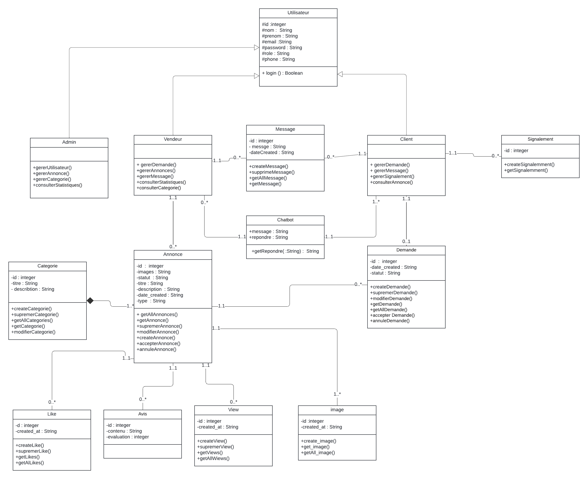

# Sarouti : Plateforme de Location et Vente de Maisons

##  Introduction
Sarouti est une plateforme en ligne dédiée à la **location et à la vente de maisons**. Elle permet aux **vendeurs, clients et visiteurs** d'interagir facilement et en toute sécurité pour acheter ou louer des biens immobiliers.

##  Objectifs du Projet
- **Simplifier** les transactions immobilières
- **Sécuriser** les paiements et les annonces
- **Automatiser** les recommandations avec un moteur intelligent
- **Offrir** une interface moderne et ergonomique

##  Fonctionnalités Principales
### - Pour les Administrateurs
- Gestion des utilisateurs et des rôles
- Validation et modération des annonces
- Suivi des transactions et rapports statistiques

### - Pour les Vendeurs
- Création et gestion d'annonces
- Échange de messages avec les clients
- Accès aux statistiques des annonces

### - Pour les Clients
- Recherche avancée avec filtres dynamiques
- Contact avec les vendeurs via un système de messagerie
- Paiement sécurisé et suivi des transactions

### - Pour les Visiteurs
- Consultation des annonces sans inscription
- Possibilité de créer un compte pour accéder à plus de fonctionnalités

## - Technologies Utilisées
### - Backend
- **Langage** : PHP 8.3.14
- **Base de données** : MySQL avec sauvegarde automatique
- **Sécurité** : JWT, Authentification MFA, Chiffrement TLS 1.3

### - Frontend
- **HTML5, CSS3, JavaScript**
- **Framework CSS** : TailwindCSS
- **API RESTful** pour la communication avec le backend
- **WebSocket** pour les notifications en temps réel
## daigrame de class 

## - Installation et Déploiement
### - Prérequis
- PHP 8.3.14 installé
- MySQL et un serveur Web (Apache, Nginx)
- Composer et Node.js

### - Installation
1. **Cloner le projet** :
   ```sh
   git clone https://github.com/votre-repo/sarouti.git
   cd sarouti
   ```
2. **Installer les dépendances** :
   ```sh
   composer install
   npm install && npm run build
   ```
3. **Configurer l'environnement** :
   ```sh
   cp .env.example .env
   php artisan key:generate
   ```
   Modifier `.env` pour connecter la base de données.
4. **Exécuter les migrations et seeders** :
   ```sh
   php artisan migrate --seed
   ```
5. **Démarrer le serveur** :
   ```sh
   php artisan serve
   ```

## - Sécurité et Performances
- **Chiffrement des mots de passe avec bcrypt**
- **Protection contre les attaques DDoS**
- **Optimisation des requêtes SQL pour des temps de réponse rapides**

## - Roadmap
- [ ] Déploiement sur un serveur cloud
- [ ] Version mobile native (iOS & Android)
- [ ] Intégration d'un chatbot IA

## - Licence
Ce projet est sous licence **MIT**. Vous êtes libre de l'utiliser et de le modifier.

---
 **Contact & Support** : lakrounehamza4@gmail.com
